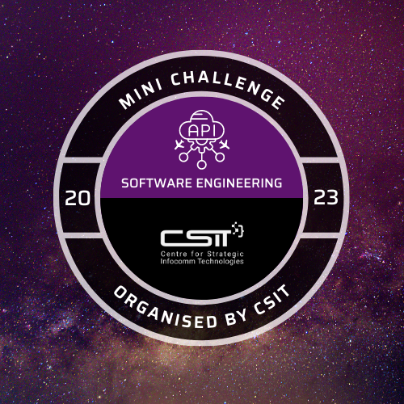

# CSIT-SE-Mini-Challenge
CSIT Software Engineering Mini Challenge 2023

A [mini challenge](https://www.csit.gov.sg/events/csit-mini-challenge) created by Centre for Strategic Infocomm Technologies (CSIT).

DockerHub image: joeng03/mighty-saver-rabbit:latest

Badge: 

Stack: 

